| | |
|---|---|
| **Project** | DataCycle Domotic — Group 14 |
| **Institution** | HES-SO Valais — Data Engineering |
| **Academic year** | 2025-2026 (Spring semester) |
| **Document version** | 2.0 |
| **Document date** | May 2026 |
| **Status** | Final |

# Executive summary

DataCycle Domotic is an end-to-end data platform that ingests sensor readings from two smart apartments (~2 880 JSON files per day), MySQL apartment metadata (10 tables — `buildings`, `rooms`, `sensors`, `devices`, `profile`, `dierrors`, etc.), and daily weather forecasts via sFTP, then transforms them through a three-layer medallion architecture (bronze, silver, gold) on PostgreSQL 17. Two KNIME 5.8 workflows produce ML-based motion (1-hour horizon) and consumption (24-hour horizon) forecasts. Power BI dashboards expose per-apartment views via Row-Level Security, and a Streamlit admin pane provides operators with one-click pipeline control plus a guided first-time-setup wizard for the .pbix.

The system runs entirely on a single Windows VM, with no cloud dependencies. Deployment is automated through a web wizard that generates a single self-contained Python installer the user runs once. After install, a continuous Python watcher schedules every layer (bronze→silver every minute, gold every 15 minutes, ML batch + cleanup daily at 07:30, full nightly catch-up at midnight) without external orchestration tools.

This document covers the architecture, data model, pipeline internals, configuration surface, security posture, ten architecture decisions made along the way (ADRs), and the operational runbook. Real install timings: ~4 hours on a fresh machine, ~15 minutes on a re-install once watermarks are in place.


# How to read this document

Forty-five pages is a lot. Use this map to jump straight to the part that answers your question.

| If you want to… | Read |
|---|---|
| Get a 5-minute mental model of what the system does | §1 Architecture overview + the diagram in §1 |
| Understand each external source and its volume | §1.1 Three external sources |
| Know what's in bronze / silver / gold | §1.2 Medallion layers + §3 Data model details |
| Read the gold star schema (dimensions, facts, FKs) | §3.2 Star schema for sensor facts |
| Trace a sensor reading from JSON file to dashboard | §2 Pipeline details (top-down: 2.1 → 2.2 → 2.3 → 2.4) |
| Understand why silver upserts are fast (and why slow) | §6 Performance — COPY upsert, unique-index wall, work_mem |
| Re-run safely after a crash | §7 Idempotency guarantees |
| Configure or tune a deployed instance | §11 Configuration + INSTALLATION.md |
| Find a specific script and what it does | §18 Project layout + §16 Scripts reference |
| See where logs land + what to grep for | §10 Monitoring & logs |
| Diagnose a common failure | §13 Troubleshooting |
| Know what the security posture is | §15 Security + §16 GDPR pseudonymisation |
| Understand a design choice | §17 Architecture decision records (10 ADRs) |
| Use the Power BI dashboards | USER_GUIDE.md (separate doc) |
| Install on a fresh VM | INSTALLATION.md (separate doc) |
| Read the GDPR / scalability / AI declaration | REPORT.md (separate doc) |

Section numbers above match the chapter headings below; ADRs (chapter 17) are also individually addressable as `ADR-001` … `ADR-010`.


# Architecture overview

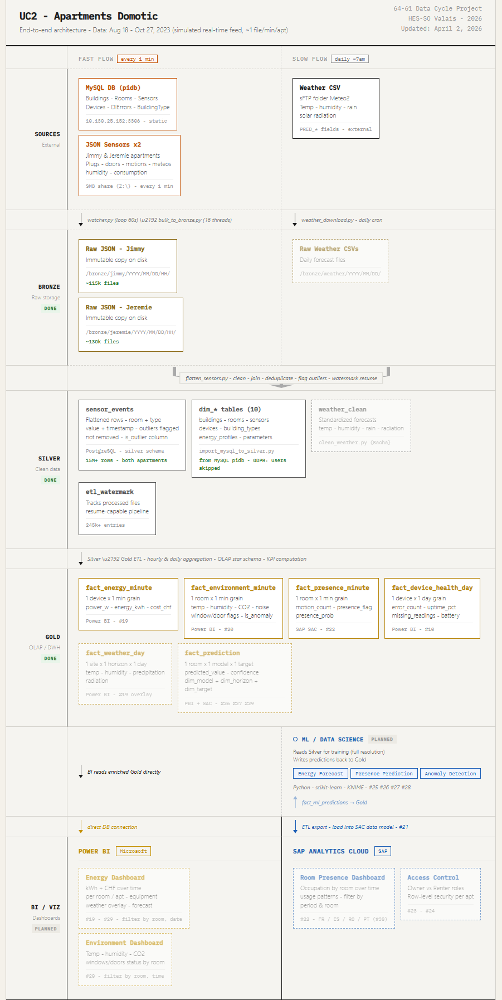

## 1.1 Three external sources

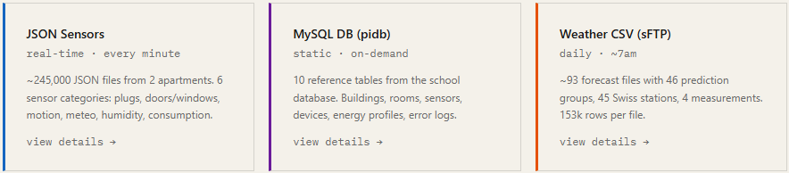


| Source | Format | Volume | Path |
|---|---|---|---|
| **SMB share** (sensor data) | One JSON per minute per apartment, ~60 sensor events per file | ~2 880 files/day for 2 apartments | `\\server\share\` → mounted as `Z:\` on the VM |
| **MySQL** (apartment metadata) | 10 tables: `buildings`, `buildingtype`, `rooms`, `sensors`, `devices`, `profile`, `profilereference`, `parameters`, `parameterstype`, `dierrors` | Static, refreshed at install (idempotent) | School DB `Appartments` (a.k.a. `pidb`) at `10.130.25.152:3306` |
| **sFTP** (weather forecasts) | One CSV per day per site, 24 prediction steps × 7 measurements ≈ 150 k rows | 1 file/day | School sFTP server, path `/Meteo2` |

Skipped MySQL tables for GDPR / out-of-scope reasons: `users`, `events`, `actions`, `achievements`, `badges`, `userrelationships`. Rationale in chapter 16.

A worked example of each source format:

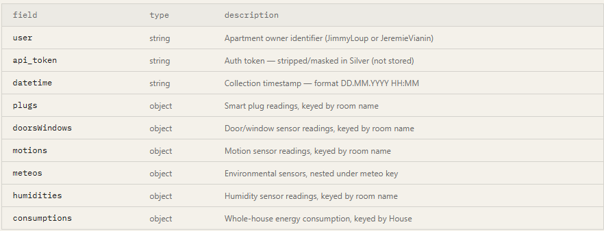

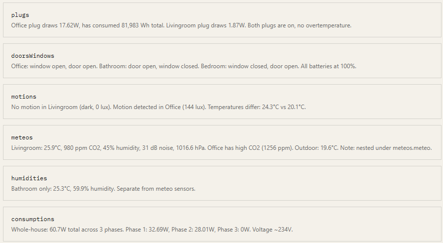


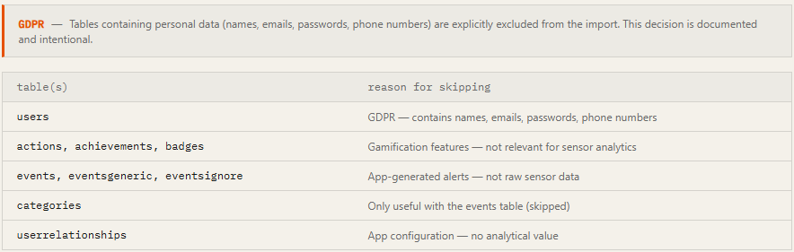

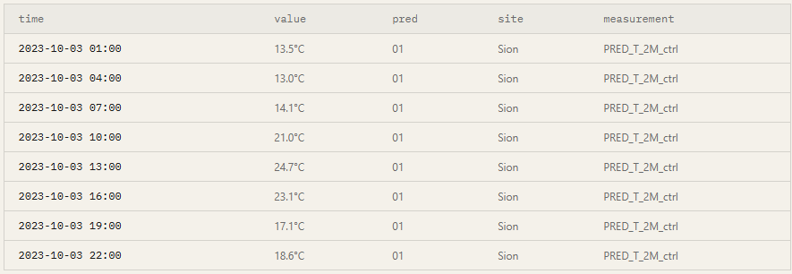

## 1.2 Medallion layers (PostgreSQL 17)

Three storage tiers, each with a distinct purpose:

- **Bronze** — raw, immutable JSON / CSV files on the filesystem, partitioned by year/month/day/hour. Acts as the source of truth before any cleanup is applied. After successful silver insert, files are gzip-compressed in place (10–15× smaller) but kept readable so silver can always be replayed from bronze.

  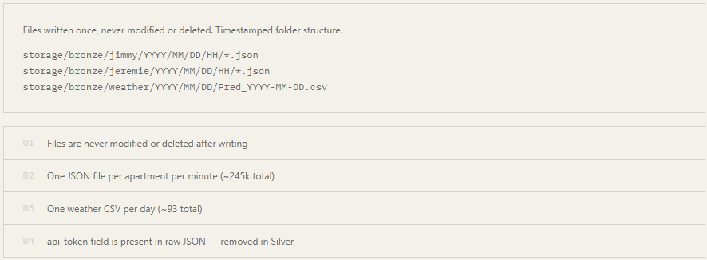

- **Silver** — cleaned, normalised PostgreSQL tables. Sensor events go to a long-format `silver.sensor_events`; weather rows go to `silver.weather_forecasts` with one row per `(timestamp, site, prediction, prediction_date, measurement)` so all forecast revisions are preserved.
- **Gold** — analytical star schema with conformed dimensions (`dim_apartment`, `dim_room`, `dim_device`, `dim_date`, `dim_datetime`, `dim_tariff`, `dim_weather_site`) and pre-aggregated fact tables (`fact_environment_minute`, `fact_energy_minute`, `fact_presence_minute`, `fact_device_health_day`, `fact_weather_hour`, `fact_prediction_motion`, `fact_prediction_consumption`) plus one materialised view (`mv_energy_with_cost`).

> **Naming convention:** all gold tables follow the `dim_<noun>` / `fact_<grain>` pattern. Materialised views are prefixed `mv_`.

## 1.3 Where each component runs

A single Python process — `ingestion/fast_flow/watcher.py` — drives the whole pipeline as a long-running scheduler:

```
                       ┌─────────────────────────────────────────┐
                       │  watcher.py — single long-running       │
                       │   Python process, the orchestrator      │
                       └────────────┬────────────────────────────┘
                                    │ every 60 s    every 15 min     every day @ 07:30   nightly @ 00:00
                                    ▼               ▼                 ▼                    ▼
SMB ──► bulk_to_bronze.py     flatten_sensors    populate_gold       weather_download      bulk_to_bronze
        (file copy +          (bronze→silver,    --sensors           clean_weather (b→s)   --full (full SMB
         predictive scan)      COPY upsert,                          populate_gold         scan, catches any
                               compress bronze)                      --weather             missed minutes)
                                                                     run_knime_predictions
                                                                     cleanup_bronze
```

KNIME workflows live in `ml/knime/*.knwf` and are deployed to `~/knime-workspace/` at install time. `scripts/run_knime_predictions.py` invokes `knime.exe` in batch mode (KNIME 5.8 — the workflows are version-pinned). Power BI's `.pbix` cannot be auto-pointed at the user's local DB at install time because PBI stores the data source in a binary `DataMashup` blob; the admin pane has a guided **First-Time Setup** wizard that walks the user through the 30-second re-point. Streamlit serves the admin pane at `http://localhost:8501`.

# Pipeline details

## 2.1 Bronze ingestion

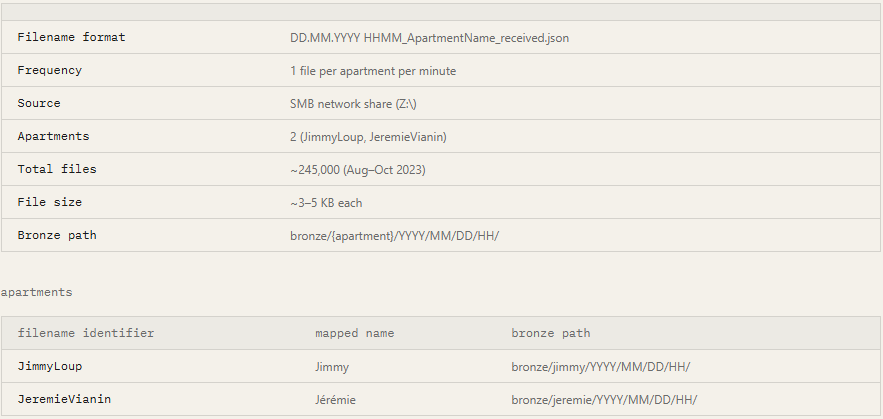

### Sensor JSONs (continuous)

`ingestion/fast_flow/bulk_to_bronze.py` runs every 60 seconds inside the watcher loop. Two operating modes:

- **Predictive mode** (default): looks at the newest filename already in bronze, predicts the next expected filename based on timestamp + 1-minute increment, checks `.exists()` on the SMB share. Stops after 10 consecutive empty minutes. Roughly 5 ms per check — cheap enough to run every minute.
- **Full scan mode** (`--full` flag, used at install + nightly at 00:00): does `os.scandir()` on the entire SMB folder, sorts results, copies anything not yet in bronze.
- **Skip list**: reads `storage\processed.log` (filenames already imported to silver) so a full rescan does not re-copy them.
- **Compressed-bronze recognition**: the discovery globs `*.json*` so already-processed files (now `.json.gz` after compress-after-silver) are still seen as "present" and not re-copied.
- **Storage layout**: `storage\bronze\<apt>\YYYY\MM\DD\HH\<filename>.json[.gz]` — partitioned by hour to keep folders small.

### Weather CSVs (daily at 07:30)

`ingestion/slow_flow/weather_download.py` runs once per day at 07:30 inside the watcher's daily ML batch:

- Connects to sFTP via paramiko, configurable retries (`MAX_RETRIES=3`, `RETRY_DELAY=600s`).
- Lists remote `*.csv`, filters to ones not already present in bronze.
- Sequential download (sFTP servers tend to dislike parallel sessions from the same client) — but with a progress bar.
- Storage: `storage\bronze\weather\YYYY\MM\DD\Pred_YYYY-MM-DD.csv`.

## 2.2 Bronze → Silver

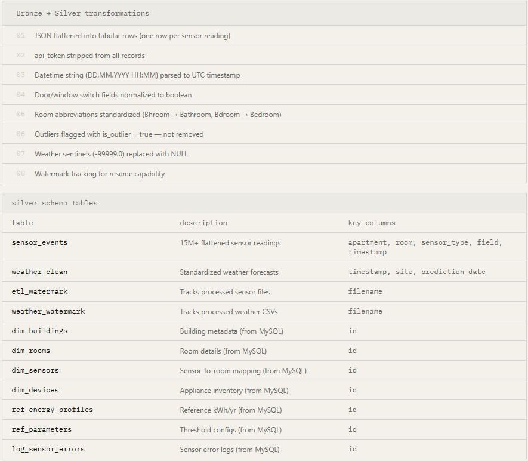

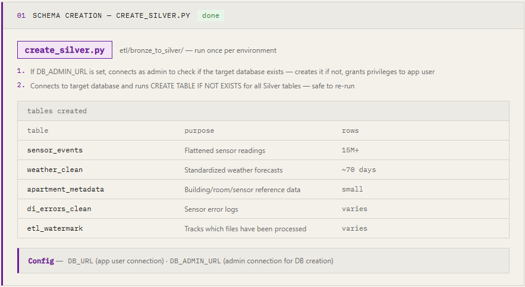

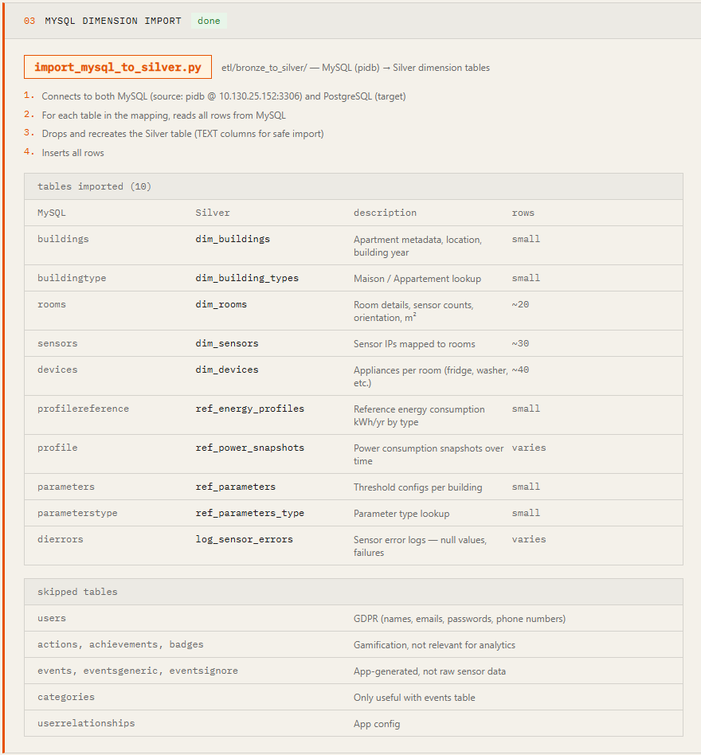

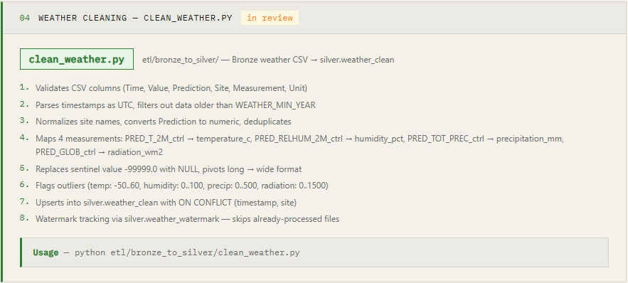

### Sensors

`etl/bronze_to_silver/flatten_sensors.py` — the heaviest hop, parallelised:

- **Discovery**: full `rglob("*.json*")` over each apartment's bronze tree (matches `.json` and `.json.gz`), diff against `silver.etl_watermark` to find new files. Uses canonical filename (strips trailing `.gz`) so the watermark stays stable across compression.
- **Parallel parsing**: `ProcessPoolExecutor(max_workers=8)`, each worker takes a batch of **5 000 files** (`BATCH_SIZE=5000`), parses JSON (gzip-aware), normalises room names, applies outlier bounds (e.g. `temperature_c ∈ [-20, 60]`), returns rows.
- **Bulk upsert**: psycopg2 `copy_expert` streams rows into a TEMP TABLE, then a single set-based `INSERT INTO silver.sensor_events SELECT DISTINCT ON (...) ... FROM tmp_table ON CONFLICT (...) DO UPDATE` finishes the merge. The `DISTINCT ON` dedupes within-batch — PostgreSQL forbids upserting the same key twice in one statement.
- **Watermark**: `INSERT INTO silver.etl_watermark VALUES %s ON CONFLICT DO NOTHING` via `psycopg2.execute_values`, committed in the same transaction as the upsert.
- **Compress-after-silver** (default ON; `KEEP_BRONZE=1` to keep raw `.json`; `DELETE_BRONZE=1` for hard-delete instead): after the upsert + watermark commit, gzip the bronze JSON in place (`<file>.json` → `<file>.json.gz`, ~10–15× smaller). Audit trail preserved — silver can be rebuilt from compressed bronze at any time. Replaces an earlier delete-after-silver policy that destroyed evidence on errors (see ADR-002).
- **Skip log**: filenames are also appended to `storage\processed.log` so a full SMB rescan on the next watcher tick does not re-copy them.

> **Performance:** ~30 k rows/sec on the worker upsert path. ~220 k files × 60 events/file ≈ 13 M rows in 10–15 minutes once the unique-index slowdown wall is solved by tuning (chapter 6.2).

**First-install backfill** uses `scripts/fast_silver_backfill.py` — a four-phase script that drops the unique constraint, loads freely, dedupes with a `DELETE ... USING ...` self-join, runs a pre-flight duplicate check, and re-adds the constraint only if no residual duplicates remain. Detail in chapter 6.3.

### Weather

`etl/bronze_to_silver/clean_weather.py` — also parallelised, file-level:

- **Parallel files**: `ProcessPoolExecutor(max_workers=4)`, each worker processes one CSV end-to-end (read with pandas, clean, COPY + upsert). Each worker has its own SQLAlchemy engine.
- **Cleaning**: validate required columns, drop rows with bad timestamps, filter to `WEATHER_MIN_YEAR=2023`, drop sentinel `-99999.0` values, flag outliers via per-measurement bounds (Swiss climate records used as bounds, see code comments).
- **Flat schema**: keeps every forecast row — one row per `(timestamp, site, prediction, prediction_date, measurement)` — so multiple model runs and prediction revisions are all preserved. Earlier pivot-to-wide approach was lossy (see ADR-002 history note).
- **Bulk upsert**: same COPY → TEMP TABLE → INSERT FROM SELECT pattern as sensors, on the 5-column unique key.
- **Compress-after-silver + processed.log**: same pattern as sensors — CSV gzipped after silver insert, filename appended to `processed.log`.

> **Performance:** 4× speedup vs sequential. ~300 files of ~150k rows each in 15–20 min on a fresh install; ~16 s for the daily incremental once the watermark is populated.

## 2.3 Silver → Gold

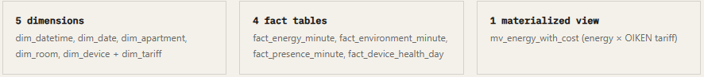

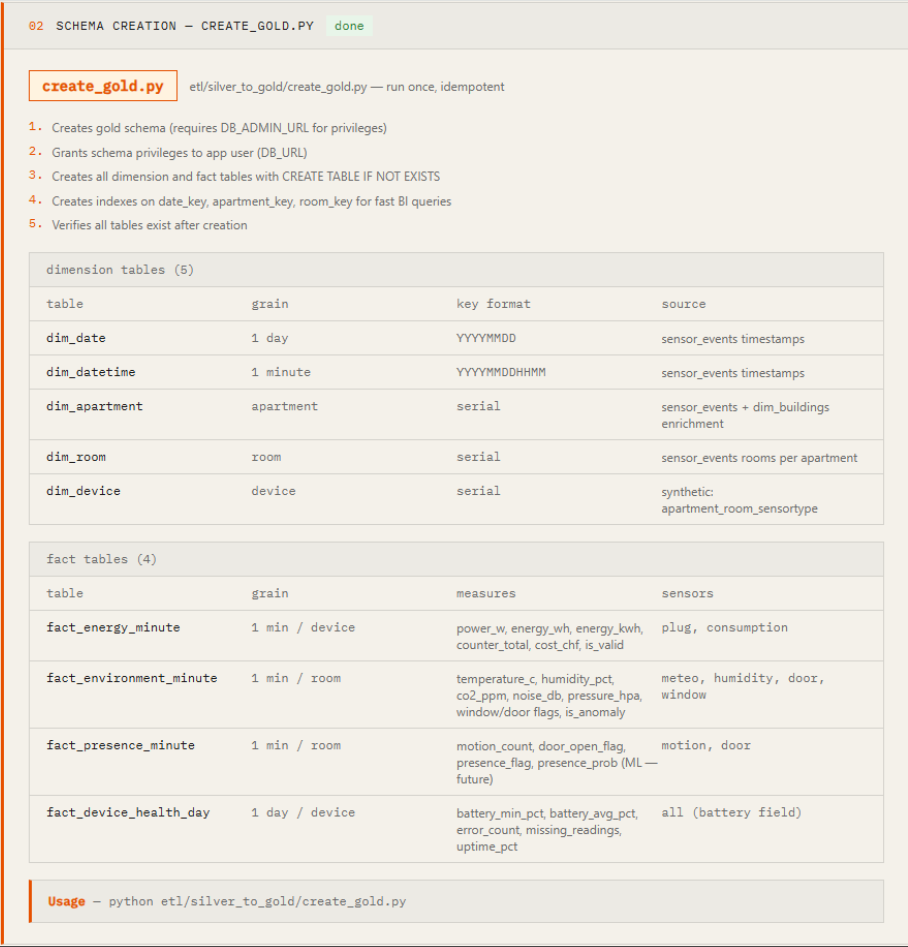

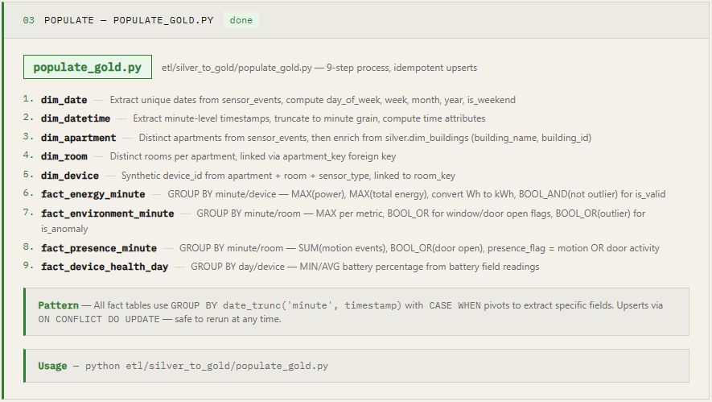


`etl/silver_to_gold/populate_gold.py` orchestrates a **9-step process** in order:

1. **`populate_dimensions`** — refresh `dim_apartment`, `dim_room`, `dim_device`, `dim_date`, `dim_datetime`, `dim_tariff`, `dim_weather_site`. Set-based SQL: `INSERT INTO gold.dim_X ... SELECT FROM silver.X ON CONFLICT DO NOTHING/UPDATE`. Anonymises apartment metadata (`owner_user_id` → NULL, `building_name` → `Building <id>`; first names retained as RLS pseudonyms — see chapter 16).
2. **`populate_sensors`** — refresh the four sensor fact tables in one pass. Each is a single `INSERT INTO gold.fact_X ... SELECT FROM silver.sensor_events ... GROUP BY ... ON CONFLICT DO UPDATE` that pivots the long-format `sensor_events` into wide-format minute facts.
3. **`populate_weather`** — refresh `fact_weather_hour` from `silver.weather_forecasts`, aggregating multiple model runs per hour (median value across runs, `n_model_runs` count preserved).
4. **`populate_health`** — daily device-health rollup from `silver.di_errors_clean` joined against expected-readings count.
5. **Refresh `mv_energy_with_cost`** materialised view — `REFRESH MATERIALIZED VIEW CONCURRENTLY` with non-concurrent fallback on first build of an empty MV. The MV joins `fact_energy_minute` ⨝ `dim_tariff` to expose `cost_chf` per minute.
6. KNIME prediction tables are written *by KNIME* directly, not by `populate_gold` — see §2.4.
7. `VACUUM ANALYZE` on the changed fact tables — keeps query plans accurate.
8. Print row counts for every gold table (visible in admin pane and logs).
9. Update `gold.populate_log` with timestamp + duration.

> **Session-level `work_mem` tuning:** each populate pass runs `SET work_mem = '256MB'` first, so the large `GROUP BY` queries stay in RAM rather than spilling to disk.

## 2.4 Gold → ML (KNIME)

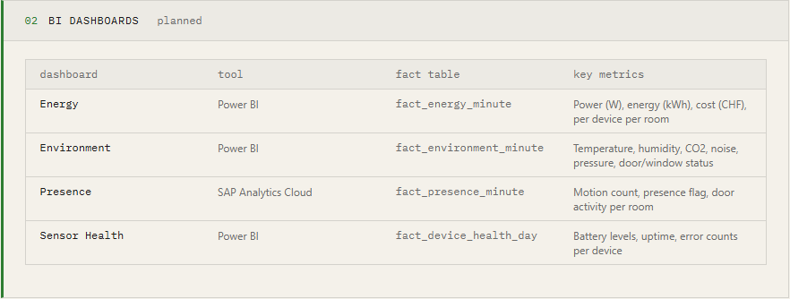


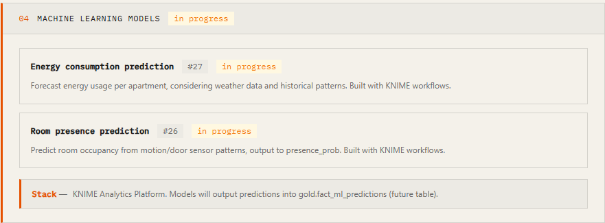

`scripts/run_knime_predictions.py` invokes `knime.exe` in batch mode:

```
knime.exe -consoleLog -nosplash -reset
  -application org.knime.product.KNIME_BATCH_APPLICATION
  -workflowDir=<workspace>/<workflow>
  -workflow.variable=db_user,<user>,String
  -workflow.variable=db_pwd,<password>,String
```

**KNIME 5.8 version pin (important).** The `.knwf` files have `created_by="5.8.0.v202510151000"` set inside the workflow XML. KNIME refuses to load a workflow exported from a newer version, so re-exporting from KNIME 5.9+ on a dev laptop will break headless runs on a 5.8 VM. Either re-export from the same KNIME version that target machines have, or patch the version stamp back in the `.knwf` zip. (Detail in ADR-009.)

**Why `-workflow.variable` for credentials?** KNIME explicitly forbids overwriting `xpassword` fields via flow variables for security. So workflows cannot bind a password flow variable directly to the PostgreSQL Connector's password slot.

**The trick (Variable to Credentials):** two String Configuration nodes (`db_user`, `db_pwd`) accept their values from `-workflow.variable=...` (allowed for strings). A Variable to Credentials node packs them into a credential object internally — KNIME's password restriction never triggers because no `xpassword` field is being overwritten from outside. The PG Connectors then read from the credential by name (`db`), getting both user + password. (Detail in ADR-003.)

**Workflows shipped:**

- `Motion_Prediction_Server.knwf` — logistic regression, predicts motion probability 1 hour ahead per apartment / room. ~437 s runtime, ~13 k prediction rows per run.
- `Consumption_Weather_Prediction_Server.knwf` — linear regression with weather features, predicts consumption 24 hours ahead. ~191 s runtime, ~66 k prediction rows per run.

Both write to `gold.fact_prediction_*` via DB Writer nodes. KNIME defines the column types — we deliberately don't pre-create those tables in `create_gold.py`.

# Data model details

## 3.1 Apartment + room dimensions

```
gold.dim_apartment
  apartment_key      PK (surrogate)
  apartment_id       "jimmy" / "jeremie"  (natural key from JSON filenames)
  building_name      anonymised to "Building <building_id>"
  name               first name only — see ADR-004 / chapter 16
  weather_site_key   FK → dim_weather_site

gold.dim_room
  room_key           PK
  room_name          normalised (e.g. "Bdroom" → "Bedroom")
  room_type          generic category (bathroom, bedroom, kitchen, …)
  apartment_key      FK
```

## 3.2 Star schema for sensor facts

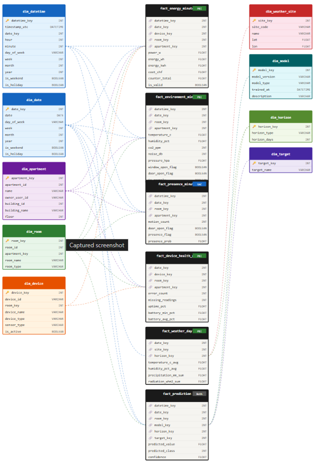

Every fact table shares the same dim spine:

```
fact_X_minute (
    datetime_key    FK → dim_datetime    (1-minute grain, YYYYMMDDHHMM)
    date_key        FK → dim_date        (1-day grain,    YYYYMMDD)
    room_key        FK → dim_room
    apartment_key   FK → dim_apartment
    device_key      FK → dim_device      (where applicable, e.g. fact_energy_minute)
    <measure cols>
    is_valid / is_anomaly  flag
)
```

Unique constraint on `(datetime_key, room_key)` — or `device_key` for energy — makes upserts idempotent. Date keys are integers (`YYYYMMDD::int`) and datetime keys are bigints (`YYYYMMDDHHMM::bigint`); both are pre-generated for the full 2023+ range in `dim_date` / `dim_datetime` so the FK joins always succeed.

## 3.3 Time dimensions

- `dim_date` — one row per calendar day, with year / month / quarter / weekday / week / `is_weekend` / `is_holiday` columns.
- `dim_datetime` — one row per minute, with `timestamp_utc`, hour, minute, day-of-week, business-hour flags.

Both pre-generated for the entire range covered by the data (2023 onward) so dim joins always succeed.

## 3.4 Predictions

Both prediction tables are written by KNIME and share a similar shape:

```
gold.fact_prediction_motion
  predicted_occupied   FLOAT     model output (probability 0..1)
  actual_occupied      INTEGER   observed value at the same key (for backtest)
  apartment            TEXT      e.g. 'jimmy', 'jeremie'
  room                 TEXT      e.g. 'Bedroom', 'Living Room'
  timestamp_rounded    TIMESTAMP 15-min slot the prediction targets
  model_name           TEXT      e.g. 'logistic_regression'
  target               TEXT      'Presence'

gold.fact_prediction_consumption
  predicted_power_w    FLOAT     forecast in watts
  actual_power_w       FLOAT     observed value at the same key (for backtest)
  apartment            TEXT
  room                 TEXT
  timestamp_rounded    TIMESTAMP
  model_name           TEXT      e.g. 'linear_regression'
  target               TEXT      'Consumption'
```

Predicted vs actual side-by-side at 15-minute grain enables Power BI to plot "predicted vs actual" charts directly, and lets future model versions coexist with older ones via the `model_name` column.

# Configuration

All runtime configuration lives in `.env` at the project root, generated by the install wizard from form input:

```
SMB_PATH=Z:\
BRONZE_ROOT=storage\bronze
DB_URL=postgresql://domotic:<pwd>@localhost:5432/domotic
MYSQL_URL=mysql+pymysql://student:<pwd>@10.130.25.152:3306/Appartments
SFTP_HOST=...
SFTP_USER=...
SFTP_PASSWORD=...
SFTP_PATH=/Meteo2
WEATHER_MIN_YEAR=2023
WEATHER_SITES=Sion

# Tunables (optional; defaults shown)
GOLD_INTERVAL_MIN=15
WEATHER_HOUR=7
WEATHER_MIN=30
KEEP_BRONZE=0             # 1 = skip compress-after-silver, keep raw .json files
DELETE_BRONZE=0           # 1 = hard-delete after silver instead of compressing
BRONZE_RETENTION_DAYS=30  # cleanup_bronze.py retention pass; -1 = keep forever
CLEAN_WEATHER_WORKERS=4
```

Tuning knobs that don't live in `.env` (Python module constants):

| Constant | Default | Where | What |
|---|---|---|---|
| `BATCH_SIZE` | 5 000 | `flatten_sensors.py` | Files per batch — bigger = fewer round-trips |
| `WORKERS` | 8 | `flatten_sensors.py` | Parallel parse workers |
| `work_mem` (Postgres) | 256 MB | per-session, `populate_gold.py` | Large `GROUP BY` stays in RAM |
| `shared_buffers` (Postgres) | **4 GB** | `postgresql.conf` (one-time install) | Hot index in RAM — see chapter 6.2 |

> **Admin password:** the PostgreSQL admin password is **never** written to `.env` — only used at install time for the one-time admin operations (CREATE DATABASE, CREATE ROLE, schema GRANT).

# Security

| Concern | Mitigation |
|---|---|
| Postgres admin credentials on disk | Used only at install time, never written to `.env` |
| App-user privileges | `domotic` has DML/DDL only on `silver` + `gold` schemas; no superuser, no `CREATE DATABASE` |
| Power BI dashboard data leakage | RLS on `dim_apartment.apartment_key` — tenants cannot see each other's data |
| KNIME passwords baked in workflows | Avoided — Variable → Credentials accepts password as String flow variable at runtime (ADR-003) |
| KNIME workflow tampering / version drift | `.knwf` files pinned to KNIME 5.8 (`created_by` field); upgrades require explicit re-export + version-stamp patch (ADR-009) |
| GDPR — personal data | Only first names retained (Art. 4(1) considers them low-risk identifiers absent additional context); `users` table never imported; `building_name` masked. Detail in chapter 16. |
| GDPR — right to erasure | Supported: `DELETE FROM gold.dim_apartment WHERE apartment_id = '...'` cascades through `apartment_key` FKs |

See ADR-004 (chapter 7) for the full GDPR rationale and chapter 16 for the data-subject-rights table.

# Performance

Numbers measured on the project VM (8 cores, 32 GB RAM, local Postgres 17 with `shared_buffers=4GB`):

| Phase | Throughput / wall time |
|---|---|
| `bulk_to_bronze` (SMB → bronze) | ~150 files/sec, 16 parallel threads |
| `flatten_sensors` (bronze → silver, COPY upsert) | ~30 k rows/sec |
| `clean_weather` (bronze → silver, 4 workers) | ~15 files/min |
| `populate_gold` (silver → gold, all 9 steps) | ~10 M rows in ~30 sec, set-based SQL |
| KNIME Motion_Prediction_Server | ~437 sec end-to-end, ~13 k rows |
| KNIME Consumption_Weather_Prediction_Server | ~191 sec end-to-end, ~66 k rows |
| **Full first-time install** (empty Postgres → ML predictions in DB) | **~4 hours** |
| **Re-install** (same machine, watermarks intact) | **~15 minutes** |

## 6.1 COPY into temp table — the silver upsert hot-path

The original `flatten_sensors` used `INSERT ... VALUES (:a, :b, ...) ON CONFLICT DO UPDATE` per row via SQLAlchemy. A 220k-file backfill took ~3 hours, almost all of which was DB write time.

Switched to: `psycopg2.copy_expert` streams rows into a TEMP TABLE `ON COMMIT DROP`, then a single `INSERT INTO silver.sensor_events SELECT DISTINCT ON (...) ... FROM tmp_table ON CONFLICT DO UPDATE` finishes the merge.

- COPY skips per-statement parsing — bytes go directly into the temp table.
- One `INSERT ... SELECT ... ON CONFLICT` is a single set-based operation, minimal overhead.
- `DISTINCT ON` dedupes within-batch (PostgreSQL forbids upserting the same key twice in one statement).

> **Result:** 3-hour backfill → 10–15 minutes (~50–150× speedup measured on the project VM).

## 6.2 The unique-index slowdown wall and Postgres tuning

On a fresh install with ~220 k bronze files, even the COPY trick is bottlenecked by the unique-index check on `silver.sensor_events`. The B-tree grows beyond the default `shared_buffers=128MB` → every upsert thrashes disk → ETA climbs from ~10 minutes to ~4 hours.

Two fixes solve it:

1. **`shared_buffers = 4GB`** in `postgresql.conf` (default is 128 MB) — keeps the unique index hot in RAM. Single biggest install-time win; brings the ETA from ~4 h to ~6 min for the full backfill. Documented in the install guide as a one-time prerequisite step.
2. **`scripts/fast_silver_backfill.py`** — see §6.3.

## 6.3 fast_silver_backfill.py — drop-constraint backfill

For the very first install with hundreds of thousands of files, even tuned Postgres still benefits from a one-shot backfill that bypasses the unique index entirely. Four phases:

1. **Drop** the unique constraint on `(apartment, room, sensor_type, field, timestamp)`
2. **Run `flatten_sensors`** without the index — 5–10× faster
3. **Dedupe** via `DELETE FROM s1 USING s2 WHERE s1.id > s2.id AND <key cols match>`
4. **Pre-flight check + re-add** — count residual duplicates before issuing the `ALTER TABLE ADD CONSTRAINT`. If any survive, abort cleanly with samples instead of letting the ALTER throw mid-statement (which would leave the table in an unconstrained state).

The pre-flight check is the safety bit — it ensures the constraint can always be put back, or you find out *why not* and fix the data first. After the very first install, normal re-runs use the COPY + ON CONFLICT path; no need to drop constraints again.

## 6.4 Compress-after-silver

After every successful silver insert + watermark commit, `flatten_sensors` and `clean_weather` gzip the source bronze file in place (`<file>.json` → `<file>.json.gz`, ~10–15× shrink). Audit trail preserved — silver can be rebuilt from compressed bronze at any time. Disk footprint stays bounded without losing the immutable-archive property.

Three escape hatches:
- `KEEP_BRONZE=1` — keep raw `.json` files (skip compression). Useful for debugging.
- `DELETE_BRONZE=1` — hard-delete after silver insert. Useful only on hard-disk-tight VMs that don't need the audit trail.
- `BRONZE_RETENTION_DAYS=N` — `cleanup_bronze.py` deletes compressed files older than N days (default 30; -1 = keep forever).

The discovery and parsing path globs `*.json*` and uses a gzip-aware opener (`open_bronze()`) so silver replay from compressed bronze works without change. (See ADR-002.)

## 6.5 Idempotency guarantees

Every step is safe to re-run:

- `bulk_to_bronze`: skips existing files in bronze (recognises both `.json` and `.json.gz`); also reads `processed.log` to skip files already imported.
- `flatten_sensors`: `silver.etl_watermark` skips already-processed files.
- `clean_weather`: `silver.weather_watermark` + `processed.log` do the same.
- `populate_dimensions`: `INSERT ... ON CONFLICT DO NOTHING/UPDATE`.
- `populate_sensors` / `populate_weather`: `INSERT ... ON CONFLICT DO UPDATE`.
- KNIME workflows: `INSERT ... ON CONFLICT DO UPDATE` on prediction tables.
- `cleanup_bronze`: only deletes files older than `BRONZE_RETENTION_DAYS`.

Belt-and-suspenders for the sensor flow: the watermark is in Postgres (transactional with the data write), and `processed.log` is a flat file appended after compress. Even if Postgres is wiped and restored, the skip-list keeps the cost of re-copying SMB files at zero.

# Architecture decision records

Ten decisions documented along the way. Only choices where viable alternatives existed are recorded as ADRs — the medallion architecture itself was prescribed by the course's reference architecture (PDF chapter "Architecture — Medaillon architecture"), so it is described in chapter 1, not as an ADR. Likewise, the COPY-based silver upsert pattern is a performance optimisation captured in chapter 6.1, not a high-level architectural choice.

Each ADR captures the context, the chosen path, the rationale, and the trade-offs accepted.

## ADR 001 · Custom Python watcher instead of Airflow

Date · 2026-03

### Context

We need to schedule a continuous bronze→silver loop (every minute), a periodic gold refresh (every 15 min), and a daily ML batch (weather + KNIME + cleanup). The textbook answer is Apache Airflow.

### Decision

A single Python process (`watcher.py`) handles all scheduling. No Airflow.

### Rationale

Airflow is heavy (web server, scheduler, executor, metadata DB) for a pipeline that has six jobs total. The 'for dummies' install goal means every dependency we add is a potential install-time failure. A 350-line script with three time conditions is easier to read, debug, and explain.

### Trade-offs accepted

No web UI for DAGs (replaced by the Streamlit admin pane); no retry/SLA primitives (subprocess return codes + warning logs cover what we need); no DAG-level dependency expression (the watcher's three time triggers call functions in fixed order).

## ADR 002 · Compress bronze after silver insert (preserve audit trail)

Date · 2026-04

### Context

The course's reference architecture (PDF chapter "Architecture — Medaillon architecture") describes the bronze layer as "Stored incrementally, with all history." In our deployment, 2 apartments × 1 file/min × 365 days = ~1 M JSON files/year per apartment; ~6 KB per file → ~2.5 GB/year just for sensors. Bronze grows visibly if we keep raw files forever, but the audit-trail property is genuinely valuable — it lets us replay silver from bronze on any failure.

The original implementation deleted bronze files after silver insert (with a `processed.log` skip-list to prevent re-fetch). Disk stayed bounded but the audit trail was destroyed on every successful run.

### Decision

Compress instead of delete. After every successful silver insert + watermark commit, gzip the bronze JSON / CSV in place (`<file>.json` → `<file>.json.gz`, ~10–15× shrink). Default ON; opt out with `KEEP_BRONZE=1` (keep raw) or `DELETE_BRONZE=1` (hard-delete). Filenames are still appended to `storage/processed.log` so future SMB rescans don't re-copy them.

The discovery and parsing paths in `flatten_sensors` and `bulk_to_bronze` were updated to recognise both `.json` and `.json.gz` (canonical-name watermark, gzip-aware reader, glob pattern `*.json*`), so silver can be replayed from compressed bronze at any time.

### Rationale

Compression preserves the audit-trail property the medallion reference architecture calls for, while still keeping disk bounded. ~250 MB/year compressed vs ~2.5 GB/year raw vs 0 with delete-after-silver. The trade-off favours retaining evidence — a corrupted silver layer can now be rebuilt without re-fetching from SMB.

### Trade-offs accepted

~10 % extra CPU at silver-ingestion time for the gzip pass. The discovery paths must always glob `*.json*` and watermark queries must canonicalise filenames (strip trailing `.gz`); both are encapsulated in `canonical_bronze_name()` and `open_bronze()` helpers.

## ADR 003 · KNIME credential injection via Variable to Credentials

Date · 2026-04

### Context

KNIME workflows need DB credentials at runtime, but those credentials live in `.env` per user. Hardcoding is unacceptable. Four KNIME mechanisms were tried unsuccessfully (inline password, Workflow Credentials + `-credential`, `-workflow.variable` directly into password field, `-option=NODE,credentials`).

### Decision

Use a Variable → Credentials node bridge: two String Configuration nodes (`db_user`, `db_pwd`) at workflow root → Variable to Credentials node → PG Connectors bind to credential `db`. At runtime the Python wrapper passes `-workflow.variable=db_user,...,String` + `-workflow.variable=db_pwd,...,String`.

### Rationale

KNIME blocks flow-variable overrides on `xpassword` fields specifically. Plain String flow variables are unrestricted, and the Variable to Credentials node builds the credential object internally before any password field is touched. KNIME's protection rule never triggers.

### Trade-offs accepted

Workflows need a one-time GUI setup (documented in `ml/knime/README.md`) that creates the three nodes + wiring. Re-exporting the `.knwf` must preserve the wiring.

## ADR 004 · GDPR — keep first names, anonymise everything else

Date · 2026-04

### Context

The `dim_apartment` table has `owner_user_id`, `building_name`, `name` (occupant first name), etc. Some are personal data under GDPR Art. 4(1).

### Decision

In `gold.dim_apartment` exposed to BI / ML: `name` keeps first names (e.g. `jimmy`, `jeremie`); `owner_user_id` is set to NULL; `building_name` is replaced with `Building <id>`; sensor data keeps `apartment_key` as the only re-identifier. Power BI enforces RLS by `apartment_key`.

### Rationale

A first name alone is generally not considered personal data under GDPR Art. 4(1) absent additional context. Stripping first names entirely would make the dashboard sterile (RLS lookup needs a human-readable key). Building name + user IDs are direct identifiers; those are masked.

### Trade-offs accepted

A determined attacker with side knowledge could re-identify `jimmy` as a specific person. Documented as a known limitation; production rollout beyond two tenants would replace first names with HMAC pseudonyms, with the lookup table in a more tightly controlled storage tier.

## ADR 005 · Two-role Postgres install (admin + app)

Date · 2026-03

### Context

Should we run everything as the Postgres superuser, or split?

### Decision

Two roles — Admin (typically `postgres`) used **only at install time, in memory**; App (`domotic`) has DML/DDL on `silver` + `gold` schemas only.

### Rationale

Principle of least privilege — runtime should not have admin rights. Limits blast radius if `.env` leaks.

### Trade-offs accepted

Slightly more complex install (one extra prompt for the admin password). Adding a new schema requires either the admin's password again, or granting `domotic` CREATE on the database.

## ADR 006 · Streamlit admin pane in addition to status.py CLI

Date · 2026-04

### Context

Operators need to check pipeline freshness, trigger ad-hoc ETL runs, read logs, see config. A CLI tool covers it for technical users; non-technical users prefer a GUI.

### Decision

Build `scripts/admin.py` (Streamlit) for the GUI. Keep `status.py` (CLI) for terminal users. Both read the same data. The admin pane also hosts the Power BI First-Time Setup wizard (see chapter 11.3).

### Rationale

Streamlit is one `pip install` away — no separate web server, no React build, no auth setup. Auto-refresh every 10 s gives near-live status. Buttons → `subprocess.Popen` with output redirected to log files — no in-process state to manage.

### Trade-offs accepted

Streamlit adds ~50 MB to the venv. No auth on the admin pane — but it binds to localhost only by default, so reaching it requires already being on the VM.

## ADR 007 · Power BI Desktop only (no Service)

Date · 2026-04

### Context

The natural deployment for view-only Power BI is Power BI Service (cloud). The HES-SO Microsoft 365 tenant restricts free Power BI signup, so individual students cannot publish to Service.

### Decision

Ship the `.pbix` as a local Desktop file. Document **F11 fullscreen** as the 'view mode' approximation, plus the admin pane wizard for the one-time data-source re-point.

### Rationale

The school requires Power BI specifically. The 'local-only' deployment requirement conflicts with Service's cloud nature anyway. Desktop in F11 is acceptable for an academic demo. RLS still enforces per-apartment data isolation at the model layer regardless of UI.

### Trade-offs accepted

End users see editing chrome until they press F11. No automatic refresh — users hit Refresh manually or use the admin pane's button. The `.pbix` ships pointing at the developer's DB and must be re-pointed once at the customer's local Postgres (the binary `DataMashup` blob can't be safely auto-patched at install time; the admin pane wizard guides the manual re-point in 30 seconds).

## ADR 008 · Self-contained installer + web wizard

Date · 2026-04

### Context

The 'for dummies' install goal means a non-technical user should run one command to deploy everything.

### Decision

Two-step install: (a) Web wizard (`/install` page) where the user fills in a form; (b) Single Python file generated client-side with all values baked in; user downloads it and runs `python data-cycle-installer.py`. The wizard's JavaScript renders `installer/install_template.py` by replacing `{{PLACEHOLDER}}` tokens. Re-runs are idempotent.

### Rationale

Zero credentials transit through any backend (form values never leave the browser). The `.py` file is auditable: user can read it before running. Re-installs are easy: keep the file, run again.

### Trade-offs accepted

The user must trust the wizard / install_template — but the file is open source. The canonical template lives in `installer/install_template.py` and is fetched at download time by the install wizard frontend (a separate Next.js project, see References). The two copies are kept in sync by a build-time copy step.

## ADR 009 · KNIME 5.8 version pin (after the 5.9 mismatch)

Date · 2026-04

### Context

KNIME enforces a strict workflow-version check at load time. A `.knwf` exported from KNIME 5.9 cannot be loaded by KNIME 5.8 — it errors with `Unsupported workflow version: future version of KNIME (5.9.x)`. We hit this when a teammate re-exported the workflows from a dev laptop running 5.9 to a customer VM running 5.8: both prediction workflows failed to load, exit code 3.

### Decision

Pin both `.knwf` files to KNIME `5.8.0.v202510151000` by patching the `created_by` field in the workflow XML. Documented in `ml/knime/README.md` as a one-line `python` snippet that rewrites the `created_by` value inside the zip archive.

### Rationale

Patching the version stamp is sufficient because the actual workflow body uses only KNIME 5.x features that are forward-compatible. The strict check is the only blocker. A 30-second metadata fix avoids the alternative (open + re-save in a 5.8 GUI on every machine that needs to update the workflow).

### Trade-offs accepted

If a real 5.9-only feature is ever added by accident during a workflow edit on a 5.9 machine, the patched-down workflow will fail at runtime instead of load. Mitigation: every workflow edit is end-to-end tested headlessly before commit, and we track `created_by` in CI to catch unintentional version bumps.

## ADR 010 · Power BI Python = pip-install into system Python (not venv redirect)

Date · 2026-04

### Context

Power BI Desktop runs Python scripts inside `.pbix` Python visuals against whatever interpreter is set under `HKCU\SOFTWARE\Microsoft\Microsoft Power BI Desktop\PythonScriptOptions`. On a fresh customer install, that key points at some unrelated system Python without `matplotlib` or `pandas`, so the first dashboard refresh fails with `ModuleNotFoundError: No module named 'matplotlib'`.

We initially tried writing a registry override pointing PBI at our project `.venv\Scripts`. PBI rejected it: `That isn't a valid Python home directory path. Try browsing to a folder where Python is installed.` PBI requires a *real* Python install layout (root with `python.exe` + `Lib/`), and a venv has `Scripts/python.exe` + no top-level `Lib/`, so the validation fails.

### Decision

Don't redirect PBI to our venv. Instead, the installer's `configure_pbi_python()` function searches `%LOCALAPPDATA%\Programs\Python\Python3{13,12,11,10}` (where python.org installers put Python by default and where PBI auto-detects), picks the newest available, and runs `<python.exe> -m pip install --quiet matplotlib pandas` into it. PBI's existing interpreter then has the dependencies its visuals need.

### Rationale

Installing two packages into PBI's existing Python is simpler, more compatible, and doesn't fight PBI's home-directory validation. The function is idempotent (pip skips already-installed) and best-effort (warns with a manual command if no system Python is found).

### Trade-offs accepted

We touch the customer's system Python, not just our venv. The install footprint isn't isolated. In practice this is fine — `matplotlib` and `pandas` are common dependencies anyone with Power BI Python visuals will need anyway.

# Technology stack

| Layer | Tool | Version | Why |
|---|---|---|---|
| Language | Python | 3.10+ (3.12 tested) | Single language across ingestion, ETL, ML wrappers, admin pane |
| Database | PostgreSQL | 17 | Strong COPY performance, JSON support for raw bronze, materialised views, free |
| MySQL client | aiomysql | 0.2 | Reads the school's `pidb` apartment metadata |
| Postgres driver | psycopg2-binary | 2.9 | Wins over asyncpg here for COPY support |
| ORM / DDL helper | SQLAlchemy | 2.0 | Used for schema bootstrap; bulk inserts go through psycopg2 directly |
| DataFrames | pandas | 2.1 | Weather CSV cleaning |
| sFTP | paramiko | 3.4 | Weather forecast download |
| ML — classical | scikit-learn | 1.3 | Baseline models / Python-side experiments |
| ML — workflow | KNIME Analytics Platform | **5.8** (pinned) | Course requirement; PG Connectors built-in |
| BI | Power BI Desktop | latest | Course requirement; RLS at model layer |
| Power BI Python visuals | matplotlib, pandas | 3.8 / 2.1 | Installed into PBI's interpreter by `configure_pbi_python()` (ADR-010) |
| Admin UI | Streamlit | 1.32 | One-pip GUI for non-technical operators |
| Config | python-dotenv | 1.0 | All runtime config in `.env` |
| Test | pytest | 7.4 | Smoke tests for parsing + idempotency |

# Database schemas — detailed

## 9.1 Silver schema

| Table | Source | Purpose |
|---|---|---|
| `silver.sensor_events` | JSON files (apartments) | Long-format events. One row per `(apartment, room, sensor_type, field, timestamp)`. Outlier flag preserved. |
| `silver.weather_forecasts` | CSV files (sFTP) | All forecast rows preserved — one row per `(timestamp, site, prediction, prediction_date, measurement)`. Multi-run forecasts kept for downstream median aggregation. |
| `silver.dim_buildings` | MySQL `buildings` | Apartment metadata mirrored from school DB (anonymised in gold). |
| `silver.dim_rooms` / `dim_devices` / `dim_sensors` | MySQL `rooms` / `devices` / `sensors` | Physical asset inventory. |
| `silver.log_sensor_errors` | MySQL `dierrors` (raw) | Untyped MySQL dump. |
| `silver.di_errors_clean` | transformed from `log_sensor_errors` | Typed + apartment-mapped + severity heuristic. Joined into `gold.fact_device_health_day`. |
| `silver.apartment_metadata` | joined snapshot from MySQL dims | Convenience wide table for downstream. |
| `silver.etl_watermark` | self | Filenames already imported (sensor pipeline idempotency). |
| `silver.weather_watermark` | self | Filenames already imported (weather pipeline idempotency). |

## 9.2 Gold star schema

**Conformed dimensions:**

- `dim_apartment` — `apartment_key` (PK), `apartment_id`, `building_name` (anonymised), `name` (first-name pseudonym), `weather_site_key`
- `dim_room` — `room_key`, `room_name`, `room_type`, `apartment_key` (FK)
- `dim_device` — `device_key`, `device_id`, `device_type`, `sensor_type`, `room_key`, `apartment_key`
- `dim_date` — `date_key` (YYYYMMDD), year, month, quarter, weekday, week, `is_weekend`, `is_holiday`
- `dim_datetime` — `datetime_key` (YYYYMMDDHHMM), `timestamp_utc`, hour, minute, day-of-week, business-hour flags
- `dim_tariff` — `tariff_key`, `provider`, `year`, `chf_per_kwh` (Oiken Sion 2023–2025 @ 0.34 CHF/kWh)
- `dim_weather_site` — `weather_site_key`, `site_name` (e.g. `Sion`)

**Fact tables:**

- `fact_environment_minute` — temperature, humidity, CO₂, noise, pressure, window/door flags, anomaly flag
- `fact_energy_minute` — `power_w`, `energy_kwh`, `is_valid`
- `fact_presence_minute` — `motion_count`, `presence_flag`, `presence_prob`
- `fact_device_health_day` — error_count, missing_readings, uptime_pct, battery_min/avg
- `fact_weather_hour` — temperature, humidity, precipitation, radiation, `n_model_runs`
- `fact_prediction_motion` — KNIME-written, motion probability per (apartment, room, 15-min slot)
- `fact_prediction_consumption` — KNIME-written, predicted power_w per (apartment, room, 15-min slot)

## 9.3 Materialised views

- `mv_energy_with_cost` — joins `fact_energy_minute` with `dim_tariff` on year to surface `cost_chf` per minute. Refreshed by `populate_gold` step 5: `REFRESH MATERIALIZED VIEW CONCURRENTLY` with non-concurrent fallback on first build of an empty MV.

> **PBI quirk:** Power BI's PostgreSQL connector hides materialised views in its navigator by default. To import this MV into the .pbix model, use Get Data → PostgreSQL → Advanced options → SQL statement: `SELECT * FROM gold.mv_energy_with_cost`. Detail in chapter 14.

# Scripts reference

Every script entry-point in the repo, with what it does and how to call it.

## 10.1 Ingestion

| Script | What it does | Run |
|---|---|---|
| `ingestion/fast_flow/watcher.py` | Long-running scheduler — bronze→silver every minute, gold every 15 min, daily ML batch + nightly catch-up | `python ingestion/fast_flow/watcher.py` |
| `ingestion/fast_flow/bulk_to_bronze.py` | SMB share → local bronze. Predictive (default) or full-scan mode. | `python ingestion/fast_flow/bulk_to_bronze.py [--full]` |
| `ingestion/slow_flow/weather_download.py` | sFTP → bronze. Sequential download with progress bar + retry. | `python ingestion/slow_flow/weather_download.py` |

## 10.2 ETL

| Script | What it does | Run |
|---|---|---|
| `etl/bronze_to_silver/create_silver.py` | DDL — creates silver schema + tables | `python -m etl.bronze_to_silver.create_silver` |
| `etl/bronze_to_silver/flatten_sensors.py` | JSON → silver.sensor_events (parallel + COPY upsert + compress-after-silver) | `python -m etl.bronze_to_silver.flatten_sensors` |
| `etl/bronze_to_silver/clean_weather.py` | CSV → silver.weather_forecasts (4 parallel workers + compress) | `python -m etl.bronze_to_silver.clean_weather` |
| `etl/bronze_to_silver/import_mysql_to_silver.py` | MySQL dim tables → silver + DIErrors transform | `python -m etl.bronze_to_silver.import_mysql_to_silver` |
| `etl/silver_to_gold/create_gold.py` | DDL — creates gold star schema | `python -m etl.silver_to_gold.create_gold` |
| `etl/silver_to_gold/populate_gold.py` | 9-step orchestrator: dimensions + sensors + weather + health + MV refresh + vacuum | `python -m etl.silver_to_gold.populate_gold [--sensors\|--weather]` |
| `scripts/fast_silver_backfill.py` | Drop-constraint backfill for the very first install (4 phases) | `python scripts/fast_silver_backfill.py` |

## 10.3 ML / BI / Admin

| Script | What it does | Run |
|---|---|---|
| `scripts/run_knime_predictions.py` | Invokes knime.exe in batch with credential injection | `python scripts/run_knime_predictions.py [motion\|consumption]` |
| `scripts/configure_bi_knime.py` | Patches host/port/db in `.knwf` workflows at install (PBI not patchable — see ADR-007) | `python scripts/configure_bi_knime.py` |
| `scripts/deploy_knime.py` | Extracts `.knwf` into `~/knime-workspace` | `python scripts/deploy_knime.py` |
| `scripts/cleanup_bronze.py` | Daily retention pass (delete files older than `BRONZE_RETENTION_DAYS`) | `python scripts/cleanup_bronze.py` |
| `scripts/admin.py` | Streamlit admin pane (incl. PBI first-time-setup wizard) | `streamlit run scripts/admin.py` (or `admin.bat`) |
| `scripts/status.py` | CLI version of admin pane | `python scripts/status.py` |

# Deployment

## 11.1 Web wizard

The website's `/install` page presents a form. The user fills:

- Postgres admin credentials (used only at install time, never written to `.env`)
- App user / DB / host / port
- MySQL connection string
- sFTP host / user / password / path
- SMB share / drive letter / credentials
- Bronze root path
- Weather sites (default `Sion`)

On submit, JavaScript renders `installer/install_template.py` with all values baked in, prompts a download (`data-cycle-installer.py`). No credentials touch any backend.

## 11.2 The installer (10 phases)

| # | Phase | Time |
|---|---|---|
| 1 | Prerequisites — check Python ≥ 3.10, git, Power BI, KNIME 5.8 | 5 s |
| 2 | Clone repo (`git clone --branch main` or `git pull` if existing) | 30–60 s |
| 3 | Write `.env` | <1 s |
| 4 | Python venv + `pip install -r requirements.txt` (re-runs catch new deps) | 2–3 min |
| 5 | Pre-flight — mount SMB, validate Postgres / MySQL / sFTP credentials | 5–10 s |
| 6 | Create app DB + user + silver/gold schemas | 10–30 s |
| 7 | Bootstrap silver — MySQL dims + (opt) full SMB backfill + weather download/clean | **2–4 h fresh / ~5 min re-run** |
| 8 | Initial gold ETL (9 steps) | 30–60 s |
| 9 | Verify + auto-config BI/KNIME — patch `.knwf` host/port/db, deploy to KNIME workspace, install matplotlib + pandas into PBI's Python (ADR-010) | 30–60 s |
| 10 | Optional autostart watcher in `shell:startup` | <1 s |

> Total typical install on the project VM: **~4 hours fresh, ~15 minutes re-run.** Idempotent — re-running picks up where it stopped.

## 11.3 Post-install

- Admin dashboard auto-launches in the browser at `http://localhost:8501`.
- Watcher registered in `shell:startup` → runs on every login.
- KNIME workflows extracted into `~/knime-workspace/`, `.knwf` files patched to the local DB, KNIME 5.8 version stamp preserved.
- **Power BI re-point (one-time, ~30 s):** the admin pane shows a guided **First-Time Setup** wizard at the top — pre-fills `localhost / domotic / domotic` with one-click copy buttons, opens the `.pbix` for you, and walks through Transform Data → Data source settings → Change Source. Once the user clicks "I've configured the connection", the wizard collapses to a small green banner. (The `.pbix` cannot be auto-patched at install time because PBI stores the connection in a binary `DataMashup` blob — see ADR-007.)

# Services & processes

Long-running and scheduled processes on the VM after install:

| Process | Schedule | Notes |
|---|---|---|
| `postgresql-x64-17` | Always running (Windows service) | Listens on `5432`; created by Postgres install |
| `watcher.py` (`pythonw.exe`) | Auto-start on user login (`shell:startup` `.lnk`) | Single Python process; embeds the scheduler |
| `knime.exe` (batch) | Spawned by watcher daily at 07:30 | Two prediction workflows; ~3–7 min each |
| `streamlit run admin.py` | On-demand (`admin.bat` double-click or installer prompt) | Localhost:8501; hand-launched |
| `bulk_to_bronze` + `flatten_sensors` + `clean_weather` | Subprocesses spawned by watcher | Inherit watcher's process; finish in seconds (continuous) or minutes (backfill) |

Stopping the watcher: `Stop-Process -Name pythonw -Force`, or kill via Task Manager. Re-enable autostart by restoring the shortcut in `shell:startup`.

# Monitoring & logs

| File | Producer | Contents |
|---|---|---|
| `install.log` | `data-cycle-installer.py` | Every step of the install with `[HH:MM:SS]` timestamps |
| `logs/clean_weather.log` | `clean_weather.py` | Persistent log handler; per-file processing details |
| `logs/weather_download.log` | `weather_download.py` | sFTP connection attempts, downloads, retries |
| `storage/admin_logs/*.log` | Streamlit admin pane buttons | Output of every action triggered from the dashboard |
| `storage/processed.log` | `flatten_sensors` / `clean_weather` | Filenames imported to silver and compressed/cleaned-up (skip-list) |
| Watcher stdout (terminal) | `watcher.py` | Live progress; not persisted by default |

All logs are plain text — the admin pane's log viewer tails the last 300 lines with ANSI colour codes stripped. For long-term retention, redirect watcher's output to a file: `python watcher.py >> logs/watcher.log 2>&1`.

> **Health check at a glance:** open the admin pane at `http://localhost:8501`. Five freshness tiles (sensors, weather, gold facts, predictions, watcher heartbeat) light green if all is well; row counts for every gold table are listed below.

# Troubleshooting

| Symptom | Likely cause | Fix |
|---|---|---|
| Database red on admin pane | Postgres service stopped, wrong `.env` `DB_URL`, or password mismatch | `Start-Service postgresql-x64-17` / verify `pg_isready` / `ALTER USER ... PASSWORD` |
| Sensor data >1 h stale | Watcher not running, or SMB drive (`Z:`) unmounted | Check `Get-Process pythonw` / `Test-Path Z:` / re-mount via `net use` |
| Silver step ETA climbs above 1 hour and keeps growing | `shared_buffers` not tuned (chapter 6.2) | Stop the installer, edit `postgresql.conf` to set `shared_buffers = 4GB`, restart Postgres service, re-run |
| `flatten_sensors` says "0 new files" but bronze has data | Old bug — pull latest, re-run. Watermark scanner now does a full scan each tick. | `git pull` + re-run |
| KNIME exit code 4 | GUI open with same workspace OR JVM module-access flags overridden | Close KNIME GUI, do NOT pass `-vmargs` from CLI (use `knime.ini` for heap) |
| KNIME `Attempt to overwrite the password` | `.knwf` was edited and lost the Variable to Credentials wiring | Re-do the setup steps in `ml/knime/README.md`, re-export `.knwf`, re-deploy |
| KNIME `Unsupported workflow version: 5.9.x` | `.knwf` was exported from a newer KNIME than the VM has | Pull latest (`.knwf` files are pinned to 5.8) or install KNIME 5.8 specifically |
| Bronze disk growing unbounded | `KEEP_BRONZE=1` in `.env` | Unset `KEEP_BRONZE`; or run `cleanup_bronze.py` for retention pass |
| Gold tables empty after install | Silver bootstrap was skipped or interrupted | `python -m etl.silver_to_gold.populate_gold` from install dir |
| **Power BI Python visual: `ModuleNotFoundError: No module named 'matplotlib'`** | PBI's Python interpreter missing matplotlib/pandas | Installer auto-installs them on a fresh run; if it failed, do it manually: `& "$env:LOCALAPPDATA\Programs\Python\Python311\python.exe" -m pip install matplotlib pandas` (adjust version to whatever PBI's Options → Python scripting shows). Then refresh the visual. |
| **Power BI: dashboard opens but tables are empty / "Cannot connect"** | `.pbix` data source still points at the developer's DB (binary blob; can't auto-patch) | Use the **Power BI First-Time Setup** wizard at the top of the admin pane — pre-fills your values + walks through Transform Data → Data source settings → Change Source. ~30 s. |
| Power BI Python visual `QuerySystemError` on a single visual | One DAX measure references a column that no longer exists in gold | Click the visual → Filters pane → look for a red exclamation icon on a field; remove + re-add it |
| **Power BI navigator doesn't show `mv_energy_with_cost`** | PBI's PostgreSQL connector hides MVs by default | Get Data → PostgreSQL → Advanced options → SQL statement: `SELECT * FROM gold.mv_energy_with_cost` |
| JVM OOM on Motion workflow | Default `-Xmx` too high for VM, or page file too small | Edit `knime.ini -Xmx` line; increase Windows virtual memory |

# Maintenance

The pipeline is largely self-maintaining; this is a maintainer's runbook for the once-a-month-if-ever tasks.

## 15.1 Daily check (30 seconds)

Open the admin dashboard. Healthy state = green database + green watcher + 5 green freshness tiles + every gold fact > 0 rows.

## 15.2 Weekly check (5 minutes)

- Bronze disk usage — should hover around 200–400 MB if compress-after-silver is on; growing unbounded means cleanup or compression is broken.
- Watcher uptime — Task Manager → `pythonw.exe` with `watcher.py` in the command line.
- `storage/admin_logs/` — review any non-empty error logs.
- `gold.fact_prediction_motion` MAX timestamp — should be within 24 hours.

## 15.3 Monthly maintenance (optional)

- Postgres `VACUUM ANALYZE silver.sensor_events / gold.fact_environment_minute` — autovacuum usually keeps up; force once a month doesn't hurt.
- Disk-usage queries: `SELECT pg_size_pretty(pg_database_size('domotic'))`.
- Re-run KNIME predictions if the workflow `.knwf` has been edited (and the version-stamp preserved per ADR-009).

## 15.4 Adding a new apartment

- School DB admin adds a row to MySQL `buildings` table.
- Wait for next gold ETL pass (or click "Run gold ETL (sensors)" in admin pane) — pulls the new row into `gold.dim_apartment`.
- Open `.pbix` in Power BI Desktop → Modeling → Manage roles → Create. Name e.g. "Apartment3", filter `[apartment_key] = 3`, save. RLS roles must be added manually — Power BI tooling has no programmatic API.
- Verify: Modeling → View as → Apartment3 → confirm only the new apartment's data shows.

## 15.5 Rotating the DB password

Change Postgres password:

```sql
ALTER USER domotic PASSWORD '<new pwd>';
```

Update `.env` `DB_URL` with the new password. Restart the watcher and any running streamlit. KNIME picks up the new password automatically (read from `.env` at runtime). The `.pbix` will prompt for credentials on next refresh — re-enter and it caches them.

# GDPR & ethics

## 16.1 Personal data inventory

| Data point | Source | GDPR status | Treatment |
|---|---|---|---|
| First name (occupant) | MySQL `buildings.firstName` | Not personal data alone (Art. 4(1)) | Kept in `gold.dim_apartment.name` for usability |
| Last name | MySQL `buildings.lastName` | Personal data | **Not imported into silver** |
| Email / phone | MySQL `buildings` | Personal data | **Not imported** |
| Building name | MySQL `buildings.houseName` | Quasi-identifier | Replaced with `Building <id>` in gold |
| Apartment key (surrogate) | Generated | Pseudonym (Art. 4(5)) | Kept; only re-identifier in fact tables |
| GPS coordinates | MySQL `buildings.lat/lng` | Personal data (precise location) | **Not imported** |
| Postal address | MySQL `buildings.address/npa` | Personal data | **Not imported** |
| `users` table (full account) | MySQL `users` | Personal data | **Not imported into silver** (defence in depth) |
| `events` / `actions` / `achievements` / `badges` / `userrelationships` | MySQL | Out-of-scope gamification | **Not imported** |
| Sensor readings | JSON files | Personal data when linkable to identified person | Aggregated to room-minute facts; tenant sees only own via RLS |

## 16.2 Lawful basis

For the academic deployment, processing is justified under Art. 6(1)(a) (consent — the school provides the data to the project as part of registered student work) and Art. 6(1)(f) (legitimate interest — analysing one's own apartment's data via RLS).

## 16.3 Data subject rights

- **Right of access** (Art. 15) — RLS gives each tenant access to their own data only via Power BI; SQL extract on demand for the lab.
- **Right to erasure** (Art. 17) — `DELETE FROM gold.dim_apartment WHERE apartment_id = '...'` cascades through `apartment_key` FKs in all fact tables; bronze cleaned via `find ... -delete`.
- **Right to data portability** (Art. 20) — silver tables can be exported as CSV via `COPY ... TO STDOUT`.
- **Right to object** (Art. 21) — handled at the lab's consent layer; once withdrawn, the delete-cascade workflow above removes the data.
- **Right to rectification** (Art. 16) — sensor readings are observations, so rarely applies; metadata fixes are MySQL `UPDATE` + re-import.

## 16.4 Risk assessment

> **Residual risk:** A determined attacker with side knowledge (e.g. who knows that `jimmy` is a specific person they've met) could re-identify pseudonymised data. We accept this for the project scope. **For a production deployment beyond two tenants, first names would be replaced with HMAC-hashed pseudonyms** — the lookup table held in a more tightly controlled storage tier. Documented as deferred work, not a current control.

For the consolidated project-level GDPR assessment, see [`REPORT.md`](REPORT.md) chapter 4.

# Scalability

## 17.1 Current limits (single-VM deployment)

| Component | Threshold | Symptom | Mitigation |
|---|---|---|---|
| Single PostgreSQL node | ~50–100 apartments | INSERT throughput drops, query plans degrade | Native partitioning by `date_key` + tune `work_mem` / `shared_buffers`; or migrate to TimescaleDB (drop-in) |
| Single bronze disk | Months of accumulation on one VM disk | Disk fills, slow scans | Compress-after-silver keeps it bounded (~250 MB/year/apt); long-term move to S3-compatible blob |
| Watcher (single process) | ~500 files/min | Falls behind on the 1-min loop | Watcher per apartment cluster, or move to Kafka / Redis Streams |
| Power BI Direct Query | Many concurrent users | Slow refreshes, dashboard timeouts | Switch to Import + scheduled refresh; consider Power BI Premium / read replica |
| MySQL source DB | Polling many tables | Read load on school DB | CDC (Debezium) or batch sync at off-peak |

## 17.2 Bronze lifecycle

On a single-VM deployment, bronze accumulates ~2.5 GB per apartment per year *uncompressed* — but compress-after-silver brings that to ~250 MB/year. Two further mitigations:

- `cleanup_bronze.py` enforces `BRONZE_RETENTION_DAYS` (default 30; -1 = keep forever) on top of compression.
- `KEEP_BRONZE=1` and `DELETE_BRONZE=1` are escape hatches for environments with different priorities.

> **Trade-off:** bronze becomes a bounded buffer (~30 days at default retention) instead of an immutable forever-archive. The silver watermark and `processed.log` skip-list together preserve the idempotency property even when raw bronze ages out.

## 17.3 Recommended evolution path

- **0–1 year** — current single-VM setup, scales to 5–10 apartments easily.
- **1–3 years** — split watcher per apartment cluster, move bronze to blob storage (e.g. MinIO on-prem or S3), migrate `silver.sensor_events` to TimescaleDB hypertable.
- **3+ years** — Kafka or similar between sources and silver, partitioned PG fact tables, read replica for BI, formal CDC against the source MySQL.

# Project layout

Top-level directories of the `data-cycle-domotic` repository:

```
data-cycle-domotic/
├── ingestion/
│   ├── fast_flow/
│   │   ├── watcher.py             # main scheduler / event loop
│   │   └── bulk_to_bronze.py      # SMB → bronze (predictive scan)
│   └── slow_flow/
│       └── weather_download.py    # sFTP → bronze
├── etl/
│   ├── bronze_to_silver/
│   │   ├── flatten_sensors.py     # JSON → silver.sensor_events (COPY upsert + compress)
│   │   ├── clean_weather.py       # CSV → silver.weather_forecasts (parallel + compress)
│   │   ├── import_mysql_to_silver.py
│   │   └── create_silver.py       # DDL for silver tables
│   └── silver_to_gold/
│       ├── create_gold.py         # DDL for gold star schema
│       ├── populate_gold.py       # 9-step orchestrator
│       ├── populate_dimensions.py # incl. anonymisation
│       ├── populate_sensors.py
│       └── populate_weather.py
├── ml/
│   └── knime/
│       ├── Motion_Prediction_Server.knwf            (KNIME 5.8 pinned)
│       ├── Consumption_Weather_Prediction_Server.knwf (KNIME 5.8 pinned)
│       └── README.md              # workflow setup + Variable→Credentials trick
├── bi/
│   ├── power_bi/
│   │   └── DataCycleDomotic.pbix  # Power BI report with RLS
│   ├── dax/                       # measure references
│   └── exports/                   # static exports
├── scripts/
│   ├── admin.py                   # Streamlit admin pane (incl. PBI setup wizard)
│   ├── admin.bat                  # one-click launcher
│   ├── status.py                  # CLI version
│   ├── configure_bi_knime.py      # patches host/port/db at install time
│   ├── deploy_knime.py            # extracts .knwf into KNIME workspace
│   ├── run_knime_predictions.py   # invokes knime.exe batch
│   ├── fast_silver_backfill.py    # drop-constraint backfill (first install)
│   └── cleanup_bronze.py          # daily retention pass
├── installer/
│   └── install_template.py        # generates data-cycle-installer.py via wizard
├── security/                      # threat model, GDPR notes, ADR-004 deep-dive
├── tests/                         # pytest suites
├── docs/v2/                       # this folder — TECHNICAL, INSTALLATION, USER_GUIDE,
│                                  # OPERATIONS, DECISIONS, REPORT, README
├── storage/                       # local data — gitignored, populated at runtime
├── requirements.txt
└── README.md
```

The website source (the install wizard frontend at the project's `/install` page) lives in a separate repo (`DCP-Website`) and is no longer carried in this repo's history.

# AI Tools Usage

Generative AI was used as a drafting and pair-programming aid during the project. No AI tool is considered an author. All architecture decisions, KNIME workflow design, Power BI dashboards (including Row-Level Security), VM deployment, and end-to-end testing were performed by the authors.

## 19.1 Tools Used

| AI Tool | Provider |
|---|---|
| Claude Sonnet 4.5 / 4.6 (via Claude Code CLI and the Claude desktop app) | Anthropic |

## 19.2 Scope of Assistance

| Area | How AI Was Used |
|---|---|
| Documentation | Drafted sections from the authors' notes; edited and corrected by the authors |
| Python boilerplate | Initial drafts for ETL scripts, watcher loop, admin pane scaffolding, the .docx generator |
| Inline code comments | Drafted docstrings and explanatory comments inside the scripts |
| Commit messages | Drafted messages explaining commits clearly and in detail |
| Log messages | Wording of progress lines, warnings, and error messages emitted by the pipeline |
| Debugging | Suggested fixes during the KNIME credential-injection investigation, the silver unique-index slowdown, the Power BI Python `matplotlib` issue, and the KNIME 5.9 → 5.8 version-mismatch resolution |
| Architecture discussions | Sounding-board for trade-offs (compress vs. delete, watcher vs. Airflow, PBI venv-redirect attempts) — final decisions made and ratified by the human team |
| Language | Grammar and consistency passes |

## 19.3 Manual Verification

Every script was executed on the project VM and verified against expected outputs. The full installer was tested end-to-end multiple times. Real metrics (~26 M silver rows, ~1.89 M `fact_energy_minute` rows, ~13 k motion + ~66 k consumption ML prediction rows) are direct evidence of the authors' testing and integration work, not artefacts of AI generation.

## 19.4 Accountability Statement

The authors retain full responsibility for the content of this report and for the design, implementation, and validation of the DataCycle Domotic platform. AI tools were used exclusively as support; all AI-assisted outputs were reviewed, corrected, and edited where necessary. Where the AI's contribution materially shaped a decision, this is reflected in the relevant ADR or in inline code comments.


# References

## Companion documents

All in `docs/v2/` alongside this file:

| Document | What's in it |
|---|---|
| [`INSTALLATION.md`](INSTALLATION.md) | Hardware/software requirements, the install wizard walkthrough with screenshots, ten install phases, verification + troubleshooting tables. |
| [`REPORT.md`](REPORT.md) | Final project report — executive summary, GDPR assessment (Art 5 + data-subject rights), ethics, scalability projections, AI usage declaration, limitations. |
| [`USER_GUIDE.md`](USER_GUIDE.md) | End-user docs for the Power BI dashboards (each tab) and the Streamlit admin pane. |
| [`OPERATIONS.md`](OPERATIONS.md) | Day-2 runbook: log locations, restart procedures, retention policies, common failure modes and recoveries. |

## Live project documentation site

Everything in this document — and more — is also published as a browsable Next.js site shipped to the customer alongside the installer (separate `DCP-Website` repository, deployed locally on the project VM at `http://localhost:3000`). The site mirrors the markdown docs and adds:

- **Architecture diagram** with clickable boxes — `/docs/architecture`
- **Star schema** diagram with clickable cards (column lists, FK paths) — `/docs/data/schema`
- **Pipeline workflows** with per-script details — `/docs/workflows/{sources-bronze,bronze-silver,silver-gold,gold-bi}`
- **Architecture decisions (ADRs)** — `/docs/architecture/decisions`
- **Setup wizard** that generates a self-contained installer — `/install`
- **Sprint cadence + meeting notes** — `/scrum`

## Source code

GitHub: <https://github.com/dehlya/data-cycle-domotic>

| Path | What it does |
|---|---|
| `ingestion/fast_flow/watcher.py` | Single long-running orchestrator (every-minute SMB scan, 15-min gold refresh, daily ML batch, monthly KNIME retrain, midnight full scan) |
| `etl/bronze_to_silver/` | flatten_sensors.py · clean_weather.py · import_mysql_to_silver.py · create_silver.py |
| `etl/silver_to_gold/` | create_gold.py · populate_gold.py (9-step) · populate_dimensions.py · populate_sensors.py · populate_weather.py |
| `ml/knime/` | Motion_Prediction_Server.knwf · Consumption_Weather_Prediction_Server.knwf (KNIME 5.8 pinned) |
| `bi/power_bi/DataCycleDomotic.pbix` | Power BI report with Row-Level Security |
| `scripts/admin.py` | Streamlit admin pane (data freshness, watcher status, PBI first-time-setup wizard) |
| `installer/install_template.py` | Template the wizard fills with credentials and ships to the customer |

## Course materials

- HES-SO Valais 64-61 Data Cycle Project — *Introduction 2026* (course PDF defining medallion architecture, deliverables, evaluation criteria)
- Use Case 2 — Apartments Domotic — backlog acceptance criteria (issues #19, #20, #22, #24, #26, #27, #29, #32, #34, #35)

## Tooling references

- PostgreSQL 17 — <https://www.postgresql.org/docs/17/>
- KNIME Analytics Platform 5.8 (batch mode, Variable to Credentials node) — <https://docs.knime.com/>
- Power BI Desktop (RLS, DAX, DataMashup blob) — <https://learn.microsoft.com/power-bi/>
- Streamlit (admin pane) — <https://docs.streamlit.io/>
- SQLAlchemy + psycopg2 (ETL connector) — <https://docs.sqlalchemy.org/>


— end of document —
